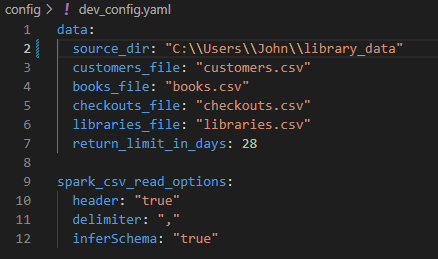
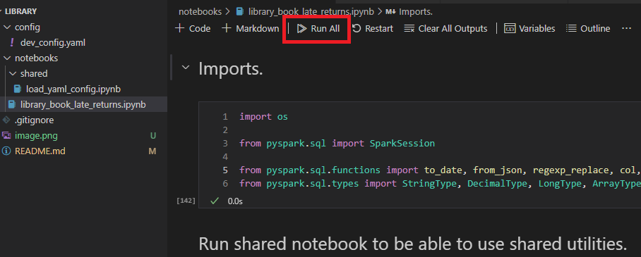
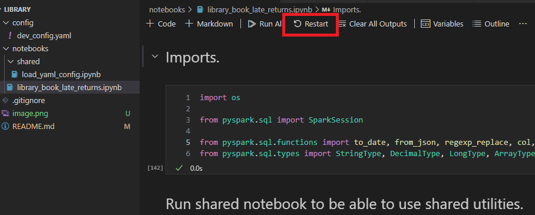

# Library Return Analysis

This project aims to analyze library usage data to build a predictive model that estimates the likelihood of a late return at the time of book checkout. A book is considered "late" if it is returned more than 28 days after being checked out.

# Analysis Workflow

The analysis follows these key steps:
* Load raw library data.
* Identify and resolve data irregularities (data cleaning).
* Consolidate data into a unified table.
* Conduct in-depth analysis and model building.

# Prerequisites

Ensure the following tools and extensions are installed:

* Python Version 3.10.4 (recommended).
* Visual Studio Code with the following extensions:
    * Jupyter
    * Python Debugger
    * Python extension
    * Pylance

# Usage

1. Update the `source_dir` parameter in the `dev_config.yaml` file to specify the directory path where your source data is stored.

2. Open the notebook and click on `Run All` to execute the analysis. Results will appear at the bottom of the notebook upon completion.

3. If an error occurs, restart the kernel by clicking on `Restart` and then click `Run All` again.

